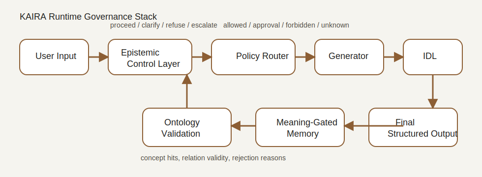

# KAIRA


KAIRA is a research-grade prototype for **runtime governance of large language models** in bounded operational settings. It is designed as a control stack above an existing generator, not as a new foundation model. The repository packages epistemic gating, policy-constrained routing, ontology-backed validation, meaning-gated memory, and explicit refusal or human handoff into a small, inspectable systems artifact.

## What KAIRA Is

- A runtime governance layer for LLM deployment
- An Epistemic Control Layer (ECL) for answerability decisions
- An Internal Deliberation Loop (IDL) for bounded candidate validation
- An ontology-backed semantic validation subsystem
- A policy-gated routing and handoff prototype for operational workflows
- A reproducible demo and benchmark harness for runtime traces

## What KAIRA Is Not

- Not a new frontier model
- Not a claim of universal truthfulness
- Not a replacement for foundation models
- Not a production deployment stack
- Not evidence of open-domain safety

## Core Architecture



Runtime pipeline:

```text
User Input
  -> Epistemic Control Layer
  -> Policy Router / Handoff Gate
  -> Generator
  -> Internal Deliberation Loop
  -> Ontology Validator
  -> Meaning-Gated Memory
  -> Final Structured Response
```

The core runtime controller lives in [kaira/runtime/controller.py](kaira/runtime/controller.py). It returns a fully structured trace containing ECL score, IDL iterations, validator outcome, ontology hits, route decision, handoff decision, final status, and latency breakdown.

## Threat Model

KAIRA is built for bounded operational risk rather than unconstrained autonomy. The current prototype explicitly targets:

- overconfident false outputs
- ontology boundary escape
- semantic paraphrase traps
- unsafe or unapproved workflow execution
- out-of-domain consequential requests
- memory write amplification from weakly supported outputs
- delayed human escalation

The repository does **not** claim to solve all safety problems. It demonstrates how these risks can be surfaced and constrained at runtime through explicit structured decisions.

## Quickstart

Install:

```bash
make install
```

Run the demo:

```bash
make demo
```

Run a single prompt:

```bash
python3 run_demo.py --prompt "What time does the gym open?"
```

Run interactive mode:

```bash
python3 run_demo.py --interactive
```

Run the evaluation harness:

```bash
make eval
```

Run tests:

```bash
make test
```

Serve the API:

```bash
make api
```

## Demo Scenarios

The main demo script is [run_demo.py](run_demo.py). It exercises five distinct runtime behaviors:

1. In-domain informational answer
2. Ontology boundary enforcement
3. Clarification request
4. Policy-gated human approval
5. Out-of-domain escalation

## Runtime Trace Example

Example structured trace:

```json
{
  "trace_id": "example-trace",
  "query": "What time does the gym open?",
  "ecl_score": 0.85,
  "ecl_decision": "proceed",
  "idl_iterations": 1,
  "validator_status": "passed",
  "route_decision": "gym_info",
  "handoff_decision": "not_required",
  "final_status": "answered",
  "memory_action": "commit_persistent",
  "oms_score": 1.0
}
```

See [examples/answered_trace.json](examples/answered_trace.json) and [examples/escalated_trace.json](examples/escalated_trace.json).

## Adversarial Rejection Example

Query:

```text
Is the 15th-floor nuclear reactor pool open?
```

Expected runtime behavior:

- ECL allows bounded evaluation because the query appears superficially in-domain
- Router maps it to `pool_info`
- Validator detects blocked ontology patterns
- IDL rejects the draft
- Final status becomes `rejected`

This is a deliberate example of **semantic validation after superficial lexical plausibility**.

## Human Handoff Example

Query:

```text
Can you diagnose my medical issue and write some code?
```

Expected runtime behavior:

- ECL assigns low support
- Decision becomes `escalate`
- No tool execution or response drafting occurs
- Final status becomes `escalated`

## Evaluation

The benchmark harness is implemented in [kaira/eval/benchmarks.py](kaira/eval/benchmarks.py). It runs:

- in-domain factual QA
- ontology boundary tests
- adversarial semantic traps
- clarification-needed cases
- mandatory escalation cases
- approval-required tool cases

Current benchmark artifacts are written to [eval/results](eval/results).
These include `benchmark_summary.json`, `per_case_results.jsonl`, `sample_traces.json`, and `metrics_table.md`.

## Repository Structure

```text
kaira/
  core/        typed runtime objects and interfaces
  runtime/     ECL, IDL, controller, generator, decisions
  policies/    routing, permissions, handoff policy
  ontology/    loading, graph ops, validation
  memory/      episodic store, semantic core, commit policy
  eval/        scenarios, metrics, benchmark harness
  api/         FastAPI server
  ui/          lightweight HTML dashboard
  utils/       config, logging, seed helpers
data/          ontology and annotation assets
docs/          architecture and operational documentation
examples/      example structured traces
paper/         paper source and PDF
tests/         unit, integration, and regression tests
```

## Configuration

- Runtime policy config: [data/default_policy.json](data/default_policy.json)
- Runtime defaults: [data/default_runtime.json](data/default_runtime.json)
- Example external config: [config.example.yaml](config.example.yaml)

Policy classes supported in the prototype:

- `allowed`
- `approval_required`
- `forbidden`
- `out_of_domain`

## Paper-to-Code Mapping

- Paper architecture framing -> [docs/architecture.md](docs/architecture.md)
- ECL / answerability control -> [kaira/runtime/ecl.py](kaira/runtime/ecl.py)
- IDL / runtime controller -> [kaira/runtime/idl.py](kaira/runtime/idl.py), [kaira/runtime/controller.py](kaira/runtime/controller.py)
- Tool routing / handoff -> [kaira/policies/router.py](kaira/policies/router.py), [kaira/policies/handoff.py](kaira/policies/handoff.py)
- Semantic validation -> [kaira/ontology/validator.py](kaira/ontology/validator.py)
- Meaning-gated memory -> [kaira/memory/commit_policy.py](kaira/memory/commit_policy.py)

More detailed mapping is in [paper/README.md](paper/README.md).

## Legacy Compatibility

The `src/` directory remains only as a compatibility shim for older notebooks and demo scripts.
The canonical implementation is the `kaira/` package.

## Limitations

- This repository is a systems prototype, not a production platform
- The ontology is intentionally small and bounded
- The generator is a deterministic demo generator, not a live model backend
- The evaluation suite is transparent and reproducible, but small
- Metrics in `eval/results` should be interpreted as prototype diagnostics, not broad safety claims

## Citation

If you use or discuss KAIRA, cite the paper in [paper/kaira_arxiv.pdf](paper/kaira_arxiv.pdf).
